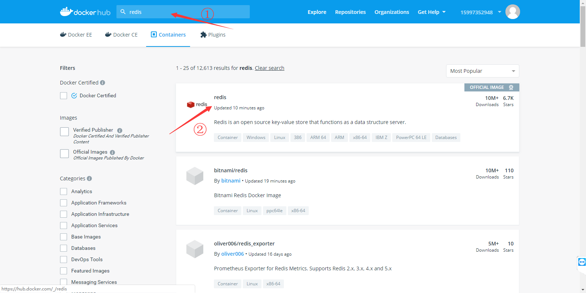
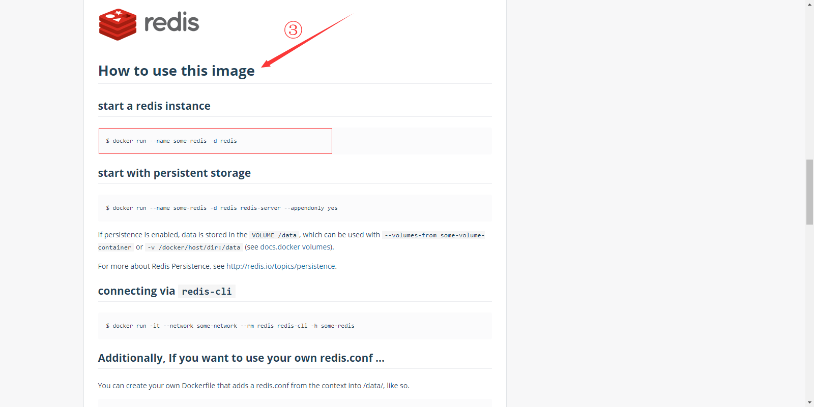
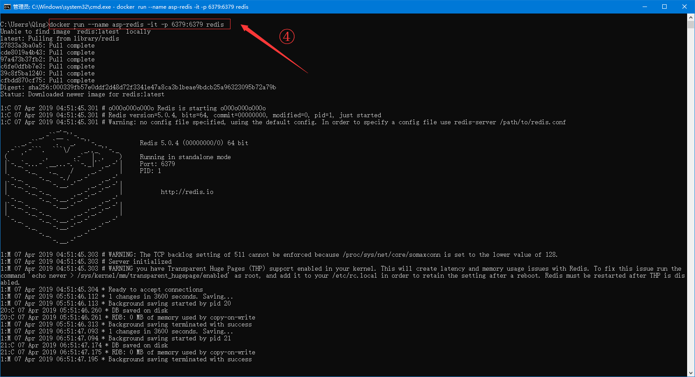
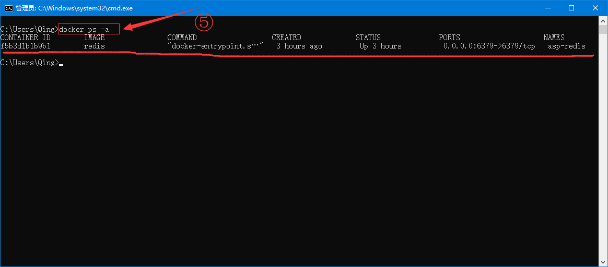
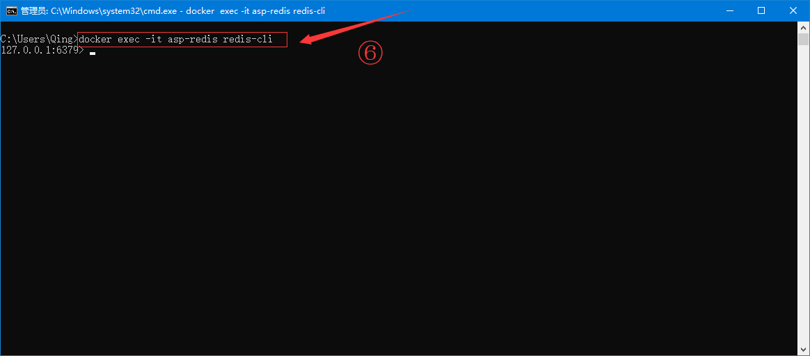
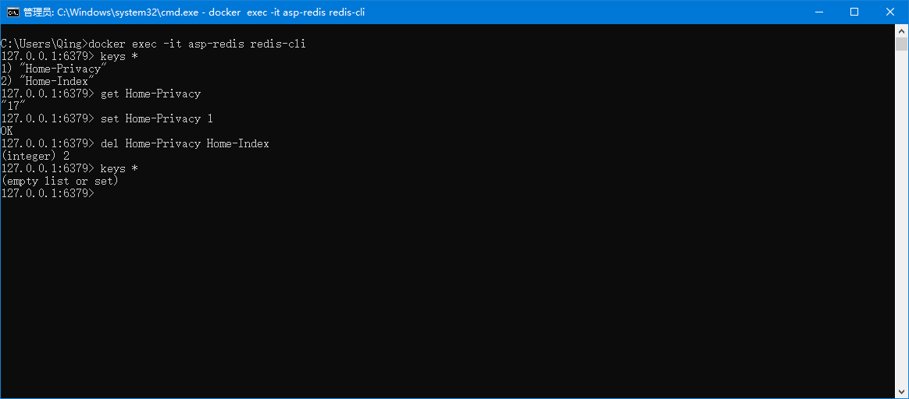
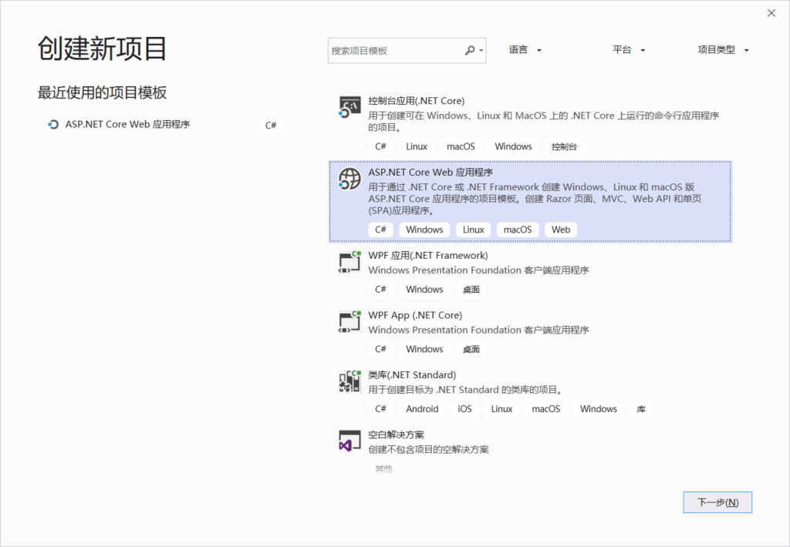
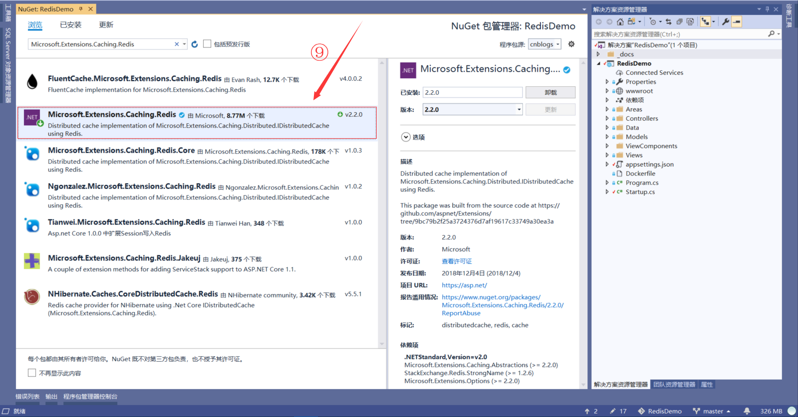
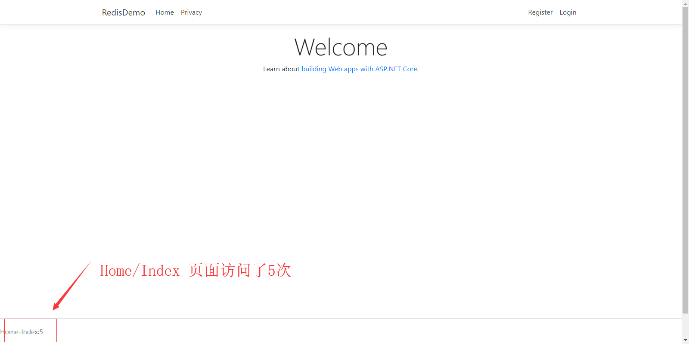
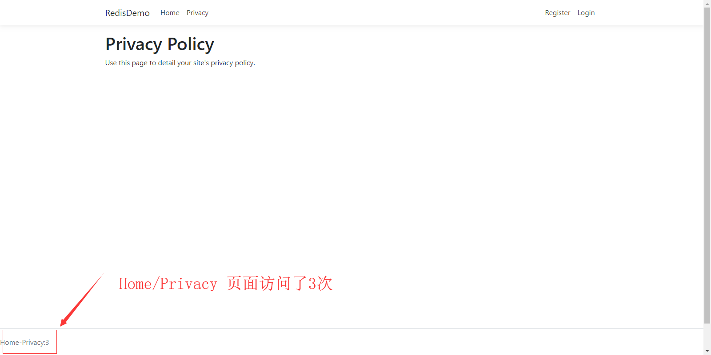

# Docker 和 ASP.NET Core Web 应用 --- Redis 入门篇

## 环境搭建
#### 1.在Docker容器中安装Redis服务镜像
* 1.进入[Docker Hub](https://hub.docker.com/)官网，搜索 redis

* 2.点击搜索结果 [redis](https://hub.docker.com/_/redis) 进入详情页面，下拉找到<b>`How to use this image`</b>节点

* 3.打开cmd窗口，执行<b>`docker run --name asp-redis -it -p 6379:6379 redis`</b>命令来拉取并安装redis服务

* 4.此时redis服务安装并启动完成，我们打开新的cmd窗口，执行<b>`docker ps -a`</b>来查看正在运行的docker镜像

* 5.执行<b>`docker exec -it asp-redis redis-cli`</b>，使用`redis-cli`连接到redis服务端

* 6.执行一些基本redis操作命令，测试redis服务的正常搭建


## 项目搭建
#### 1.新建一个ASP.NET Core Web 应用
* 7.新建一个ASP.NET Core Mvc 模板项目 RedisDemo

* 8.为当前项目添加Redis操作的相关依赖:`Microsoft.Extensions.Caching.Redis`*

* 9.在`Startup:ConfigureServices`中依赖注入Redis连接配置:
```csharp
services.AddSingleton<IConnectionMultiplexer>(ConnectionMultiplexer.Connect(Configuration.GetConnectionString("RedisConnection")));
```
* 其中`appsetting.json`中Redis连接字符串`RedisConnection`的内容:
```json
{
  "ConnectionStrings": {
    "RedisConnection": "localhost:6379,password="
  }
}
```
* 10 在项目中使用连接对象操作Redis数据库
```csharp
    public class CounterViewComponent : ViewComponent
    {
        private readonly IDatabase _db;

        public CounterViewComponent(IConnectionMultiplexer redis)
        {
            _db = redis.GetDatabase();
        }

        public async Task<IViewComponentResult> InvokeAsync()
        {
            var controller = RouteData.Values["controller"].ToString();
            var action = RouteData.Values["action"].ToString();
            if (!string.IsNullOrWhiteSpace(controller) && !string.IsNullOrWhiteSpace(action))
            {
                var pageId = $"{controller}-{action}";
                await _db.StringIncrementAsync(pageId);
                var count = await _db.StringGetAsync(pageId);
                return View("_Default",pageId + ":" + count);
            }

            throw new Exception("Page Not Found...");
        }
    }
```

## 案例展示

#### 1.使用Redis实现页面访问量的统计




